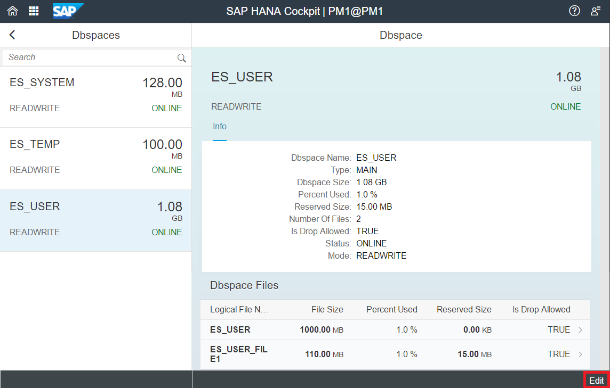

## Prerequisites
 - **Proficiency:** Beginner
 - **Tutorials** Enlarging a `Dbspace` File Using Reserved Space


## Details
### You will learn
  - How to drop a `Dbspace` file using HANA Cockpit
  - How to drop a `Dbspace` file using a SQL Command

### Time to Complete
 **10 Min**

 ---
[ACCORDION-BEGIN [Step 1: ](Dropping a Dbspace File)]

Dropping `Dbspace` files can be done from both SAP HANA Cockpit and HANA Studio.

In this tutorial, we will be dropping the files from Cockpit. Similarly to the previous tutorial, scroll to the Dynamic Tiering section in the tenant overview page, and select "**Manage Dynamic Tiering `Dbspaces`**" under the Dynamic Tiering Links of your HANA Cockpit.

We can drop the `Dbspace` file that we just created in the previous tutorials by first selecting the `ES_USER` and click **Edit** in the bottom-right corner.



Click the red `X` button next to `ES_USER_FILE1`. A pop-up dialogue box will appear confirming the deletion of the `Dbspace` file. Click "**OK**" to delete the file.


[ACCORDION-END]

[ACCORDION-BEGIN [Step 2: ](SQL Command to Drop a Dbspace File)]

> Note: You can also delete the `Dbspace` file using HANA Studio (through the System Database) by running a SQL command:
``` sql
ALTER EXTENDED STORAGE ALTER DBSPACE ES_USER DROP FILE "ES_USER_FILE1";
```

[DONE]

[ACCORDION-END]
