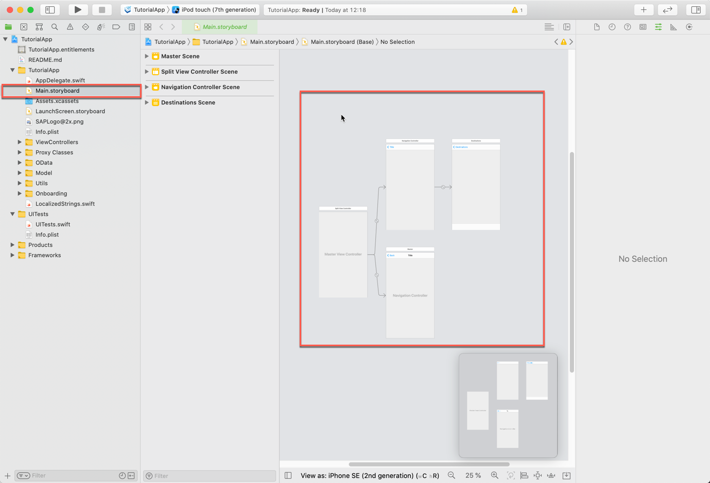
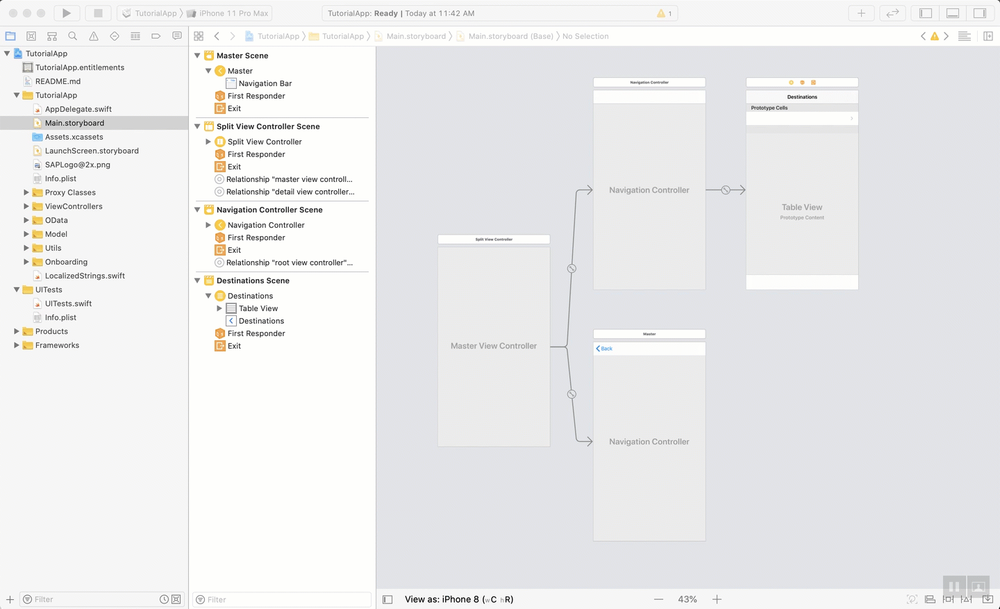
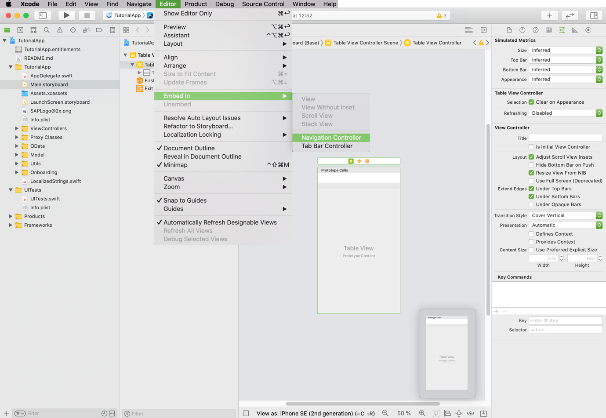
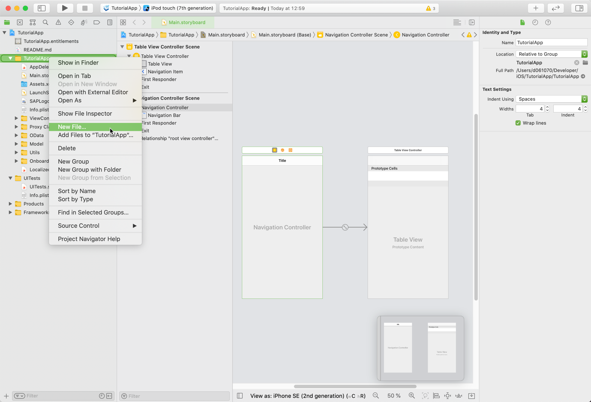
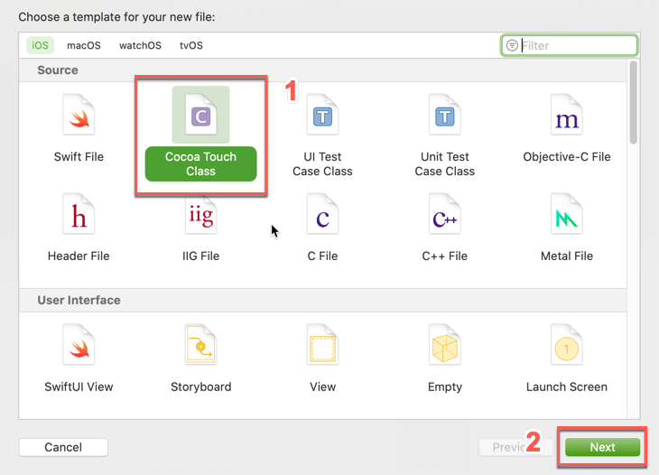
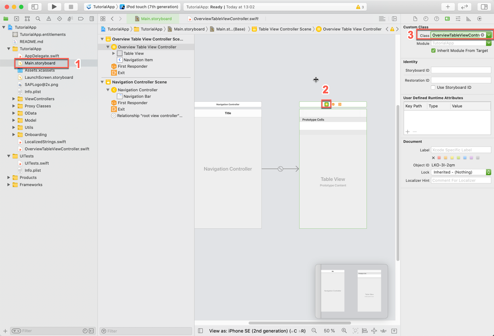

## Prerequisites

- **Development environment:** Apple Mac running macOS Catalina or higher with Xcode 12 or higher
- **SAP BTP SDK for iOS:** Version 6.0 or higher

## Details

### You will learn  

- How to create your first iOS screen
- How to retrieve data and display it on the screen
- How to follow the SAP Fiori for iOS guidelines.

---

[ACCORDION-BEGIN [Step 1: ](Replace generated UI with your own)]

The Human Interface Guidelines for SAP Fiori for iOS has certain screens defined that you can use as guidance on how you could structure a business app.

Usually a business application has some sort of overview screen giving the user a entry point to key information he or she might need to do their daily work. From there, the user can navigate into more detailed information or more concrete workflows.

> If you're interested in the HIG of SAP for SAP Fiori for iOS, visit: [SAP Fiori for iOS Design Guidelines](https://experience.sap.com/fiori-design-ios/)

For this tutorial, you will implement an overview screen displaying a KPI Table View Header, products and customers.


In the [Set Up the SAP BTP SDK for iOS](group.ios-sdk-setup), you've learned how to create an Xcode project using the SAP BTP SDK Assistant for iOS. The result of the generation process of the Assistant can be a split view screen if chosen. In this tutorial you will change the generated UI to match the screen shown above, the overview screen of your app.

1. First, open you Xcode project if not opened already and select the **`Main.storyboard`**, this will open the `Main.storyboard` in the Interface Builder of Xcode.

    > The Interface Builder allows you to create complete app flows including the UI for each screen of those flows.

    !

    For now go ahead and select all displayed View Controllers in the `Main.storyboard` and simply delete them.

    !

2. Next, click the **Object Library** and search for **`Table View Controller`**. Drag and drop the object on the canvas of the Interface Builder.

    !

3. Thinking ahead, you know that you want to have navigation to various screens from the overview screen. Using a Navigation Controller and embedding the just-created View Controller in it allows us to use the power of the Navigation Controller for navigation. The Navigation Controller handles the navigation stack for you, which is exactly what you want.

    Select the added View Controller and click **Editor > Embed In > Navigation Controller**. This will embed your View Controller in a Navigation Controller. You should see the Navigation Bar appear in the View Controller.

    !

    !

4. Almost every View Controller you're adding to the storyboard needs a **Cocoa Touch Class** representing the logic implementation of that View Controller.

    Control + click your project source in the **Project Navigator** on the left-hand side and select **New File**.

    !

5. Select the **Cocoa Touch Class** in the upcoming modal sheet, and click **Next**.

    !

    Make sure that your class is going to subclass of **`UITableViewController`** and change the name to **`OverviewTableViewController`**. Click **Next** and then **Create**.

    !

    Great! You've created your first Table View Controller Swift class, now you have to set this class as **Custom Class** in the **`Main.storyboard`** View Controller.

6. Open the storyboard and select the created View Controller. On the right side, you can see the side bar. Click the **Identity Inspector** to set the custom class to **`OverviewTableViewController`** and hit return on your keyboard.

    !

    Notice the title of the Table View Controller on the left side changes accordingly to the entered custom class.

7. Lastly you have to make the Navigation Controller an initial View Controller. Doing this will allow us to instantiate an initial View Controller from Storyboard and tells the system the main entry point for that specific Storyboard.

    Select the **Navigation Controller** and open the **Attributes Inspector** to check the box next to **Is Initial View Controller**.

    !

[DONE]
[ACCORDION-END]

[ACCORDION-BEGIN [Step 2: ](Change the Application UI Manager code to display the overview)]

In order to display the newly added overview screen right after the onboarding process is finished, you have to make some manual changes in the **`ApplicationUIManager.swift`** class. This class is mainly responsible for coordinating the UI flow for user onboarding all the way to the first screen after the onboarding process.

1. Open the `ApplicationUIManager.swift` class using the Project Navigator and look for the `showApplicationScreen(completionHandler:)` method.

    > **Hint:** You can use the `Open Quickly` feature of Xcode to search for the `ApplicationUIManager` class with `Command + Shift + O`. Once you've opened the file, you can quickly jump to the `showApplicationScreen(completionHandler:)` function by using the **jump bar** at the top of the editor area pane.

    !

    In the method you see an `if-else` statement initializing a Split View Controller, which is non-existing anymore because you have your Overview Table View Controller.

    > For all upcoming tutorials and code snippets, you will find inline comments used to help you understand what the code is actually doing. Read the inline comments carefully!

2. Change the method code to the following:

    ```Swift[15-16]
    func showApplicationScreen(completionHandler: @escaping (Error?) -> Void) {
        // Check if an application screen has already been presented
        guard self.isSplashPresented else {
            completionHandler(nil)
            return
        }

        // Restore the saved application screen or create a new one
        let appViewController: UIViewController
        if let savedViewController = self._savedApplicationRootViewController {
            appViewController = savedViewController
        } else {
            // This will retrieve an instance of the Main storyboard and instantiate the initial view controller which is the Navigation Controller. Force cast to UINavigationController and assign the instance as appViewController.

            let overviewTVC = UIStoryboard(name: "Main", bundle: Bundle.main).instantiateInitialViewController() as! UINavigationController
            appViewController = overviewTVC
        }
        self.window.rootViewController = appViewController
        self._onboardingSplashViewController = nil
        self._savedApplicationRootViewController = nil
        self._coveringViewController = nil

        completionHandler(nil)
    }

    ```

Great you did complete all necessary steps to replace the generated UI with your own. Go ahead and run the app on **`iPhone 12 Pro`** or any other simulator to see the result.

> In case you haven't onboarded yet, go through the onboarding process before seeing your Overview Screen appear.


[DONE]
[ACCORDION-END]

[ACCORDION-BEGIN [Step 3: ](Implement basic functionality of overview screen)]

As you can see, the overview screen is a little bit more complicated then just simply displaying a Table View with some data. The overview screen contains the following UI controls:

- `UITableView`: A table dequeuing and displaying registered Table View Cells.
- `FUIObjectTableViewCell`: A SAP Fiori control used to display business entity objects. [`FUIObjectTableViewCell`](https://help.sap.com/doc/978e4f6c968c4cc5a30f9d324aa4b1d7/Latest/en-US/Documents/Frameworks/SAPFiori/Classes/FUIObjectTableViewCell.html)
- `FUICollectionViewTableViewCell`: A SAP Fiori control allowing you to display a `UICollectionView` in a Table View Cell. The cell handles the resizing for you. [`FUICollectionViewTableViewCell`](https://help.sap.com/doc/978e4f6c968c4cc5a30f9d324aa4b1d7/Latest/en-US/Documents/Frameworks/SAPFiori/Classes/FUICollectionViewTableViewCell.html)
- `UITableViewCell`: The mother of all cells!
- `FUITableViewHeaderFooterView`: A SAP Fiori control used to display Header Footer Views for a Table View section. [`FUITableViewHeaderFooterView`](https://help.sap.com/doc/978e4f6c968c4cc5a30f9d324aa4b1d7/Latest/en-US/Documents/Frameworks/SAPFiori/Classes/FUITableViewHeaderFooterView.html)
- `FUIKPIHeader`: A SAP Fiori control used for displaying `KPIs` as a Table View Header. [`FUIKPIHeader`](https://help.sap.com/doc/978e4f6c968c4cc5a30f9d324aa4b1d7/Latest/en-US/Documents/Frameworks/SAPFiori/Classes/FUIKPIHeader.html)
- `FUILoadingIndicatorView`: A SAP Fiori control used to display a loading indicator on screen. [`FUILoadingIndicatorView`](https://help.sap.com/doc/978e4f6c968c4cc5a30f9d324aa4b1d7/Latest/en-US/Documents/Frameworks/SAPFiori/Classes/FUILoadingIndicatorView.html)
- `FUIItemCollectionViewCell`: A SAP Fiori control used to display business entity objects in a Collection View Cell. [`FUIItemCollectionViewCell`](https://help.sap.com/doc/978e4f6c968c4cc5a30f9d324aa4b1d7/Latest/en-US/Documents/Frameworks/SAPFiori/Classes/FUIItemCollectionViewCell.html)

If you look at the list of controls you might recognize that you're picking from not only SAP Fiori controls but also from Apple `UIKit` controls. Because all of the SAP Fiori controls are written natively in Swift and inherit of `UIKit` controls, you can pick and choose the controls you need.

!

You will now implement some code to set up the `OverviewTableViewController` for displaying all the above mentioned controls, load data from the backend using the `SAPOData` framework, and perform navigation to the customer and product list.

1. Open the `OverviewTableViewController.swift` file and add the following import statements right below the `import UIKit` statement:

    ```Swift
    import SAPFiori
    import SAPFoundation
    import SAPOData
    import SAPFioriFlows
    import SAPCommon
    import ESPMContainerFmwk

    ```

    You are going to use APIs and classes from all of those SAP BTP SDK for iOS frameworks to build the Overview screen.

    The overview screen will have a short list of products and a collection of customers. Implementing two arrays containing elements of type **Product** and **Customer** will do the job of storing the loaded entities later on.

    The `ESPMContainerFmwk` is a helper framework which contains the OData proxy classes generated out of the Metadata document of the consumed OData service. Importing this framework allows you to access the OData proxy classes but also the generated dataservice.

2. Instantiate two arrays as class properties:

    ```Swift

    private var products = [Product]()
    private var customers = [Customer]()

    ```

3. Because you want to use the logging API of the `SAPCommon` framework you have to retrieve and store an instance of the logger. Luckily the logger gets initialized in the `AppDelegate` through generated code by the Assistant. The logger is initialized with a default log level of **`Debug`**.

    Add the following line of code above the products array:

    ```Swift

    private let logger = Logger.shared(named: "OverviewTableViewController")

    ```

4. Next, implement all the needed Table View data source and delegate methods you need. Fortunately you used a Table View Controller instead of a View Controller, and because you did that you can simply override those methods directly in class without declaring the needed protocols (`UITableViewDataSource, UITableViewDelegate`) in the class definition.

    Implement the needed methods below the `viewDidLoad()` method, so that your class looks like that:

    ```Swift[32-81]
    //
    //  OverviewTableViewController.swift
    //  TutorialApp
    //
    //  Created by Muessig, Kevin on 3/20/20.
    //  Copyright © 2020 SAP. All rights reserved.
    //

    import UIKit
    import SAPFiori
    import SAPFoundation
    import SAPOData
    import SAPFioriFlows
    import SAPCommon

    class OverviewTableViewController: UITableViewController {

      private var products = [Product]()
      private var customers = [Customer]()

      override func viewDidLoad() {
          super.viewDidLoad()

      }

      // MARK: - Table view data source

      /**
        If you look at the image displaying the Overview Screen when done you can see that there are 2 sections.
        One is for the customer and one for the product. If you look closely you can see the gray dividers between those sections. These are actually of type FUITableViewHeaderFooterView which makes it necessary to have sections defined for them as well. That is why the number is 4.
      */
      override func numberOfSections(in tableView: UITableView) -> Int {
          return 4
      }

      /**
        Here you tell the Table View how many rows you want to display for each section.
        You can use the *Switch* statement to do so.

        - Case 1:   return 3 if the count of available products is equal or higher then 3
        - Case 3:   return 1 if the count of available customers is equal or higher then 1. That is because you only display the FUICollectionViewTableViewCell here.
        - Default:  return 0 because those are the dividers which are not going to display any rows.

      */
      override func tableView(_ tableView: UITableView, numberOfRowsInSection section: Int) -> Int {
          switch section {
          case 1: if products.count >= 3 { return 3 }
          case 3: if customers.count >= 1 { return 1 }
          default:
              return 0
          }
          return 0
      }

      /**
      At the moment return a UITableViewHeaderFooterView.
      */
      override func tableView(_ tableView: UITableView, viewForHeaderInSection section: Int) -> UIView? {
          return UITableViewHeaderFooterView()
      }

      /**
      At the moment return a UITableViewHeaderFooterView.
      */
      override func tableView(_ tableView: UITableView, viewForFooterInSection section: Int) -> UIView? {
          return UITableViewHeaderFooterView()
      }

      /**
      At the moment return a UITableViewCell.
      */
      override func tableView(_ tableView: UITableView, cellForRowAt indexPath: IndexPath) -> UITableViewCell {
          return UITableViewCell()
      }

      // MARK: - Navigation

      // In a storyboard-based application, you will often want to do a little preparation before navigation
      override func prepare(for segue: UIStoryboardSegue, sender: Any?) {
          // Prepare segue for navigation
      }
    }

    ```

[DONE]
[ACCORDION-END]


